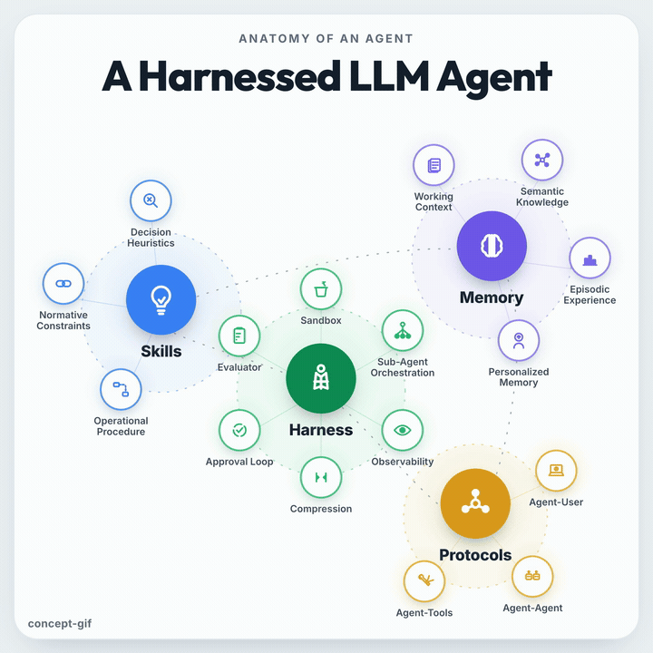
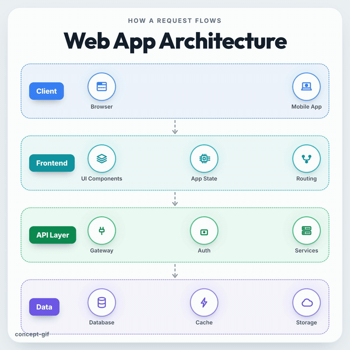

# concept → gif

Turn **any concept** into a looping, animated infographic GIF. Describe the idea
as data; a fixed engine renders it as a seamless square loop where every element
has a subtle micro-motion. Built on [HyperFrames](https://hyperframes.heygen.com)
(HTML-as-video) with a reusable data-driven diagram engine.

|  `galaxy` metaphor — anatomies / taxonomies  |  `flow` metaphor — architectures / pipelines  |
| :---: | :---: |
|  |  |

## The idea: separate look, content, and metaphor

A "theme" should decide the **metaphor** (the visual structure), not just the
palette. So three things are split:

| File         | Role                              | Changes per…            |
| ------------ | --------------------------------- | ----------------------- |
| `design.js`  | the **look** (palette, type, motion feel) | brand / style    |
| `frame.js`   | the **content** + the **metaphor**        | every topic      |
| `index.html` | the **engine** (icons, motion grammar, layouts) | never (per topic) |

To make a GIF about a new topic you write **one `frame.js`** — pick a metaphor,
choose a density and style, list the groups, give every node an icon and a
motion. The engine does the rest.

## Ground-Up System

Everything needed to produce and review a concept GIF lives in this repo:

| Layer | File(s) | Purpose |
| --- | --- | --- |
| Intake | `frame.md`, `design.md`, `SKILL.md` | ask concept, density, style, and metaphor |
| Content schema | `frame.js` | topic data: groups, labels, icons, motions |
| Visual system | `design.js` | palette, typography notes, loop timing |
| Engine | `index.html` | layouts, icons, motion grammar, timeline |
| Render | `render-gif.sh` or example renderers | MP4-to-GIF or local Pillow fallback |
| Proof check | `proof-check.py`, `proof.json` | clutter, jitter, seam, and connector-lane checks |
| Outputs | `examples/*/renders/` | normal GIF, ultra-HD GIF, previews, proof reports |

The workflow is intentionally opinionated: ask the right user choices up front,
generate from structured data, render deterministic motion, then proof-check the
actual GIF before sharing.

```
window.FRAME = {
  metaphor: "galaxy",            // or "flow"
  title: "A Harnessed LLM Agent",
  zones: [
    { id:"skills", label:"Skills", color:"blue", x:0.2, y:0.4, r:0.15,
      hub:{ icon:"bulb", motion:"glow" },
      sats:[ { label:"Decision Heuristics", icon:"decide", motion:"morph" }, … ] },
    …
  ],
};
```

## Metaphors

- **`galaxy`** — groups orbit a center: a hub (icon + label) ringed by
  satellites, with a dashed orbit weaving through. For *parts of a whole*.
- **`flow`** — stacked, color-coded tiers of components joined by downward
  marching arrows. For *stages a thing passes through* (request → response).

The theme picks the metaphor. Adding a third (`timeline`, `network`, …) is one
builder in `LAYOUTS` — see [`concept-gif/frame.md`](concept-gif/frame.md) §7.

## Density

Ask this before building when the request does not already imply detail level:

```text
How dense should this be?
- Sparse: clean high-level summary
- Balanced: default explainer
- Dense: more complete, may need stricter proof-checking
```

Use `balanced` by default. As a rule of thumb:

| density | galaxy budget | flow budget |
| --- | --- | --- |
| sparse | 2-3 zones, 2-3 satellites each | 2-3 tiers, 2-3 items each |
| balanced | 3-4 zones, 3 satellites each | 3-4 tiers, 2-3 items each |
| dense | 4 zones, 3-4 satellites each | 4-5 tiers, 3-4 items each |

If the idea needs more than about 16 visible nodes, split it into multiple GIFs
instead of making one crowded one.

## Style

Ask this alongside density when the request does not already imply a look:

```text
Which visual style should this use?
- Editorial light: clean default infographic
- Technical blueprint: sharper, cooler, more diagram-like
- Product polish: warmer, presentation-ready
```

Keep style changes in `design.js`; keep concept structure in `frame.js`. See
[`concept-gif/design.md`](concept-gif/design.md) for the preset directions.

## Motion grammar

Every node gets exactly one seamless, seek-safe micro-loop:
`glow · pulse · bob · squish · sway · spin · orbit · blink · flow · draw · bars ·
shuffle · morph`. They loop perfectly (no seam) because each spans the full loop
and returns to its start; variety comes from different periods, not staggered
starts.

## Make your own

```bash
cp -r concept-gif/engine my-gif && cd my-gif
$EDITOR frame.js                      # describe your concept (see concept-gif/frame.md)
npx hyperframes lint && npx hyperframes validate && npx hyperframes inspect
npx hyperframes render --quality standard --resolution square -o renders/out.mp4
../concept-gif/render-gif.sh renders/out.mp4   # mp4 -> looping gif
python3 ../concept-gif/proof-check.py renders/out.gif --out renders/proof/out
# add --manifest proof.json when the GIF has arrows/connectors to protect
```

## Proof Check

Run a proof check after rendering a GIF. It samples frames through the loop and
flags common readability failures before the GIF is shared:

- **clutter** — too much local edge density in one area
- **blocked paths** — manifest-defined arrow/connector lanes lose continuity
- **jitter** — one frame changes much more than neighboring frames
- **loop seam** — the last frame does not return cleanly to the first frame

For arrows and connectors, add a small `proof.json` next to the example. Each
lane is a rectangle around the expected path, with the connector color and
minimum continuity thresholds. See
[`examples/skills-vs-sub-agents/proof.json`](examples/skills-vs-sub-agents/proof.json).

Some examples also include a fallback Pillow renderer for environments where
headless browser rendering is unavailable. For example:

```bash
cd examples/skills-vs-sub-agents
npm run render:gif       # 900x900
npm run render:gif:uhd   # 1800x1800 ultra-HD
npm run proof:uhd
```

Generated proof outputs are part of the review trail: keep the `.proof.json`
for machine-readable checks and the `.proof.png` contact sheet for quick visual
review.

## Repo layout

```
concept-gif/            the reusable skill
  SKILL.md              when/how to use it (Claude Code skill)
  design.md             the look — spec for design.js
  frame.md              the content — schema + metaphor / icon / motion catalogs
  proof-check.py        rendered GIF proof-checker
  render-gif.sh         mp4 -> looping gif helper (ffmpeg)
  engine/               index.html (engine) · design.js · frame.js · vendor/gsap.min.js
examples/
  harnessed-llm-agent/  galaxy — "A Harnessed LLM Agent"
  frontend-backend/     flow   — "Web App Architecture"
  rag-answer-loop/      flow   — "RAG Answer Loop"
  skills-vs-sub-agents/ flow   — "Skills vs Sub-Agents"
```

## Notes

- Output is a **square, seamless, looping** GIF (rendered MP4 → GIF via ffmpeg).
- Files under `examples/*/renders/` are generated outputs; re-render them after
  changing an example's `frame.js` or engine files.
- Self-contained: GSAP is vendored locally; rendering is deterministic and needs
  no network.
- Fonts (Outfit / Inter by default) are embedded by HyperFrames from static CSS —
  to change them, edit the two `font-family` lines in `index.html` and pick a
  supported font.

Made with [HyperFrames](https://hyperframes.heygen.com).
