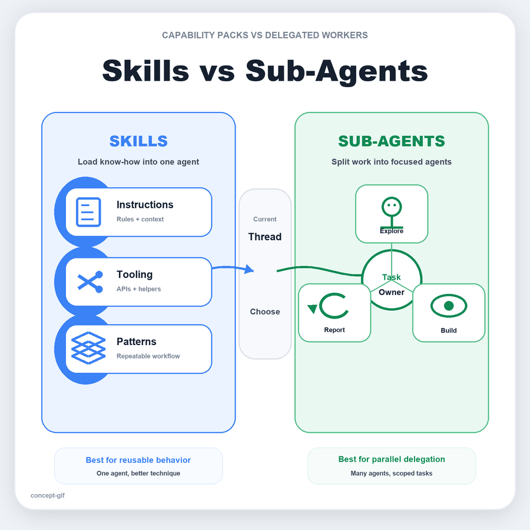
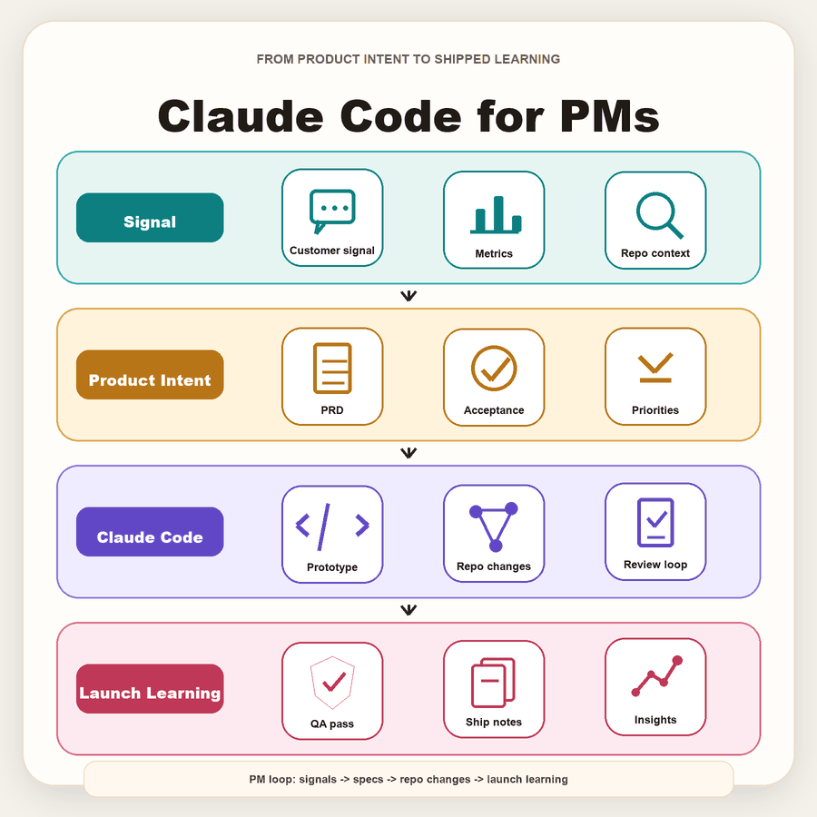
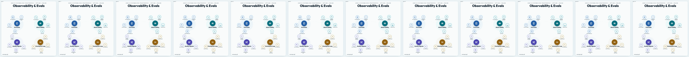

# Concept to GIF Video


> Turn one concept into a looping animated infographic by describing the idea as data.

[](https://hyperframes.heygen.com)
[](https://gsap.com)
[](https://github.com/aishwaryaashok14/concept-to-gif-video/stargazers)

**Concept to GIF Video** is a tiny generator for animated concept maps. You write
one `frame.js` file that describes the idea, choose a visual metaphor, and a
fixed HTML engine renders the whole thing as a deterministic square video or GIF.

It is not a hand-animated GIF.

It is a little machine.

**Built by Aishwarya Ashok** - [X](https://x.com/aishashok14) · [LinkedIn](https://www.linkedin.com/in/aishwarya-ashok/)

```js
window.FRAME = {
  metaphor: "flow",
  title: "RAG Answer Loop",
  tiers: [
    { label: "Question", items: [
      { label: "User Query", icon: "user", motion: "blink" },
      { label: "Embed", icon: "network", motion: "pulse" },
    ] },
    { label: "Retrieve", items: [
      { label: "Search", icon: "search", motion: "pulse" },
      { label: "Chunks", icon: "papers", motion: "shuffle" },
    ] },
  ],
};
```

## Gallery

These are real outputs from the repo. Each one starts as structured concept data,
then becomes a clean animated loop.

| Galaxy: anatomy / taxonomy | Flow: architecture / pipeline |
| :---: | :---: |
|  |  |
| `examples/harnessed-llm-agent` | `examples/frontend-backend` |

| Skills vs Sub-Agents | Claude Code for PMs |
| :---: | :---: |
|  |  |
| `examples/skills-vs-sub-agents` | `examples/claude-code-for-pms` |

## The idea

I keep noticing that the interesting part of this project is not only the GIF
itself. It is the decision to keep the idea, the taste, and the engine separate.

`frame.js` is the script.

`design.js` is the wardrobe.

`index.html` is the stage.

HyperFrames is the camera.

That split changes the whole feeling of making the GIF. You are not nudging
pixels around. You are teaching a page how to perform an idea.

For the observability and evals GIF, `frame.js` is the only file that is really
about observability. It names the zones: eval suite, observability, quality
signals, and closing the loop. It lists the satellites: golden datasets, traces
and spans, hallucination rate, CI quality gates, drift detection.

But the same engine can read a different `frame.js` and become a web app request
flow, a RAG answer loop, an agent anatomy, or a product workflow.

Same stage. New script.

**If the structure is good, the content can keep changing without asking the
whole system to reinvent itself.**

## How it works

The project has three main files:

| File | Role | You edit it |
| --- | --- | --- |
| `frame.js` | the content: title, groups, labels, icons, motions, metaphor | every new topic |
| `design.js` | the look: themes, palettes, presets, semantic roles, loop timing | only to add reusable styles |
| `index.html` | the engine: layouts, icons, motion grammar, GSAP timeline | almost never |

The engine supports two visual metaphors:

- **`galaxy`**: hubs with satellites orbiting a shared idea. Good for anatomies,
  taxonomies, and "parts of a whole".
- **`flow`**: stacked tiers joined by downward arrows. Good for pipelines,
  architectures, request flows, and staged workflows.

The theme is not just a palette. It helps pick the structure that makes the idea
easier to understand.

## Why it renders cleanly

The animation uses a paused GSAP timeline. Every visible node gets one small
motion: `glow`, `pulse`, `bob`, `sway`, `spin`, `orbit`, `blink`, `flow`, `draw`,
`bars`, `shuffle`, or `morph`.

HyperFrames does not record the page by waiting and hoping the browser keeps up.
It opens the HTML page, finds the registered timeline, seeks to an exact time,
and screenshots that frame. Frame 90 is "set the playhead to 3.0 seconds, then
capture."

That is why the repo avoids `Math.random()`, `Date.now()`, and network-fetched
animation dependencies. The same timestamp should produce the same pixels.

Determinism is care.

## Quick start

Clone the repo:

```bash
git clone https://github.com/aishwaryaashok14/concept-to-gif-video.git
cd concept-to-gif-video
```

Copy the reusable engine into a new project:

```bash
cp -r concept-gif/engine my-gif
cd my-gif
```

Edit `frame.js` with your concept, then run the HyperFrames checks:

```bash
npx hyperframes lint
npx hyperframes validate
npx hyperframes inspect
```

Render the MP4:

```bash
npx hyperframes render --quality standard --resolution square -o renders/out.mp4
```

Convert the MP4 to a GIF:

```bash
../concept-gif/render-gif.sh renders/out.mp4 renders/out.gif
```

Proof-check the rendered GIF:

```bash
python3 ../concept-gif/proof-check.py renders/out.gif --out renders/proof/out
```

The proof check samples the final GIF, not the source file. It looks for clutter,
jitter, loop-seam jumps, and connector-lane problems when a `proof.json` manifest
is present.

## Make a good concept GIF

Keep the idea smaller than your first instinct.

| Choice | Use when | Typical size |
| --- | --- | --- |
| `sparse` | you want a crisp shareable summary | 2-3 groups, 2-3 items each |
| `balanced` | you want the default explainer | 3-4 groups, 2-3 items each |
| `dense` | you need a fuller technical map | 4-5 groups, 3-4 items each |

Pick the metaphor before the details:

- Use `galaxy` when the idea is an anatomy: `Skills`, `Runtime`, `Memory`.
- Use `flow` when the idea is a sequence: `Question`, `Retrieve`, `Generate`,
  `Ground`.

Short labels survive GIF size better than clever labels.

## Examples to learn from

### Observability & Evals

Path: `observability-evals/frame.js`

A dense `galaxy` map with four zones: `Eval Suite`, `Observability`, `Quality
Signals`, and `Closing the Loop`. It shows how much detail the engine can carry
when the concept genuinely needs a technical map.



### A Harnessed LLM Agent

Path: `examples/harnessed-llm-agent/frame.js`

A clean `galaxy` example with three hubs: `Skills`, `Runtime`, and `Memory`.
This is the easiest place to see how an anatomy turns into a visual structure.

### Web App Architecture

Path: `examples/frontend-backend/frame.js`

A compact `flow` example. It maps a request through `Client`, `Application`, and
`Platform` with short labels that still read at small sizes.

### RAG Answer Loop

Path: `examples/rag-answer-loop/frame.js`

A pipeline-shaped example: `Question` to `Retrieve` to `Generate` to `Ground`.
RAG wants a flow because the important thing is sequence.

### Product Workflow Roles

Path: `examples/product-workflow-roles/frame.js`

The clearest example of presets and semantic roles. It uses
`preset: "product-workflow"` so roles like `context` and `quality` can carry
visual meaning without hand-picking every node.

### Skills vs Sub-Agents

Path: `examples/skills-vs-sub-agents/frame.js`

A deliberately sparse flow. The point is not to show everything. The point is to
survive being viewed small.

## What makes it different

- **Content-first authoring.** Most new GIFs only need a new `frame.js`.
- **Metaphor before decoration.** The visual structure is chosen from the shape
  of the idea, not only from color taste.
- **Tiny motions, clean loop.** Each node gets one seek-safe micro-motion.
- **Local animation dependency.** GSAP is vendored so rendering does not depend
  on a CDN.
- **Rendered-output proofing.** The checker looks at the actual GIF after MP4
  conversion.
- **Reusable taste.** Themes, presets, and semantic roles live in `design.js` so
  future GIFs can inherit them.

## Repo structure

```text
.
├── README.md
├── concept-gif/
│   ├── SKILL.md
│   ├── design.md
│   ├── frame.md
│   ├── mini-brief-blog.md
│   ├── proof-check.py
│   ├── render-gif.sh
│   └── engine/
│       ├── index.html
│       ├── design.js
│       ├── frame.js
│       └── vendor/gsap.min.js
├── examples/
│   ├── harnessed-llm-agent/
│   ├── frontend-backend/
│   ├── rag-answer-loop/
│   ├── product-workflow-roles/
│   ├── skills-vs-sub-agents/
│   └── claude-code-for-pms/
├── observability-evals/
└── multi-agent-orchestration/
```

The reusable system lives in `concept-gif/`. The example folders are real GIF
projects you can copy, inspect, and modify.

## Notes

- Output is a square looping GIF, rendered as MP4 first and converted with
  `ffmpeg`.
- Files under `examples/*/renders/` are generated outputs. Re-render after
  changing an example's `frame.js` or engine files.
- Fonts are embedded by HyperFrames from static CSS. If you change fonts, update
  the CSS in `index.html` and the matching values in `design.js`.
- If an idea needs more than about 16 visible nodes, split it into multiple GIFs.

## GitHub social preview

Use one of the preview images or GIF stills as the repository social preview:

```text
GitHub repo -> Settings -> Social preview -> Upload image
```

A good default is `examples/skills-vs-sub-agents/renders/skills-vs-sub-agents-preview.png`.

Made with [HyperFrames](https://hyperframes.heygen.com).
